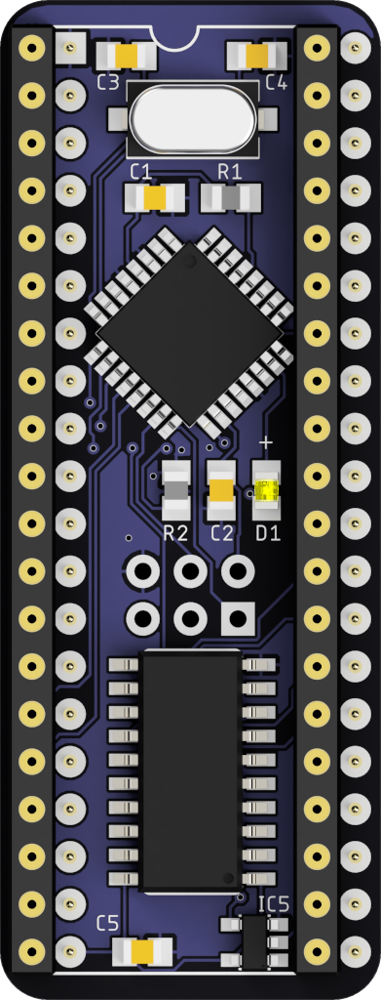
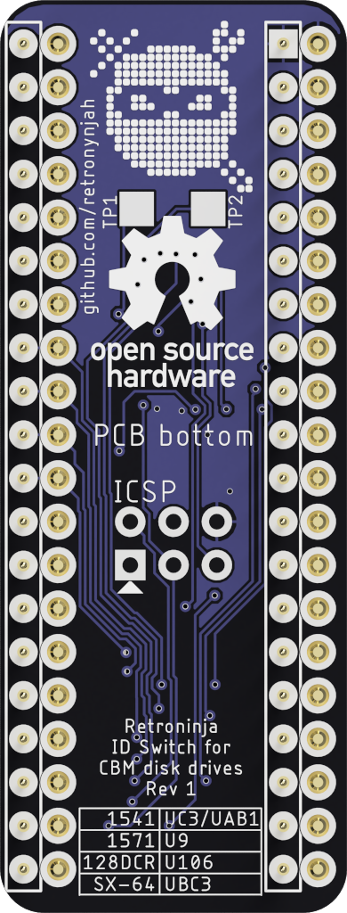
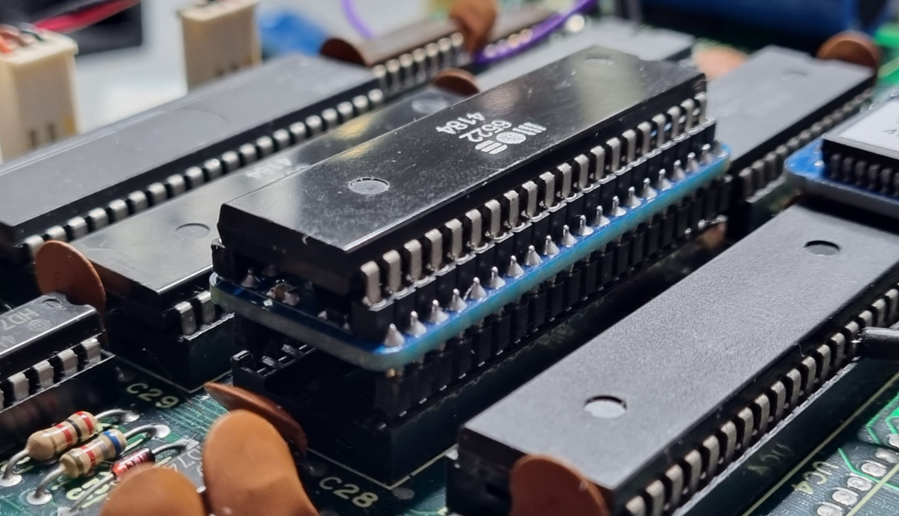
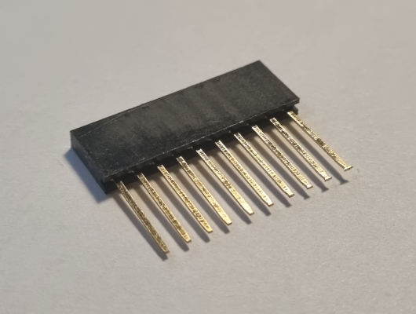
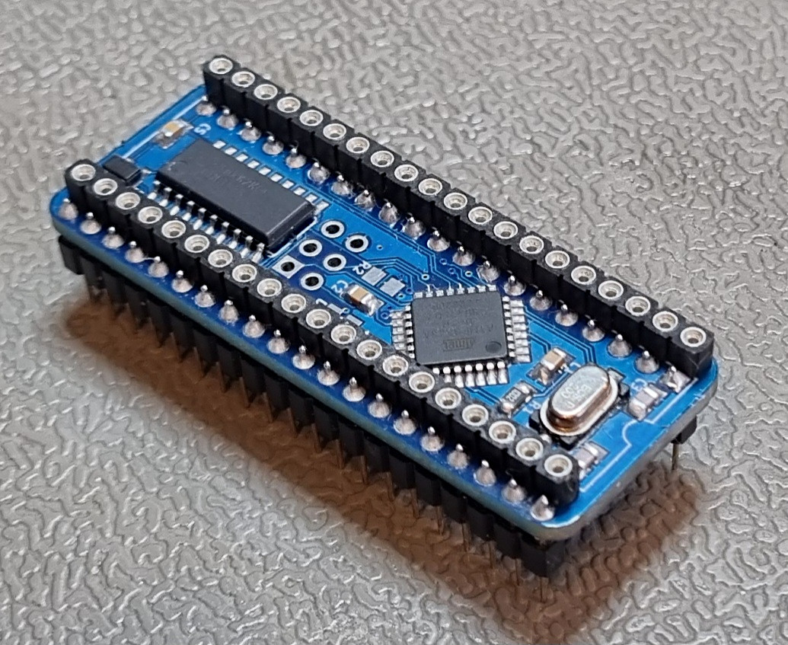
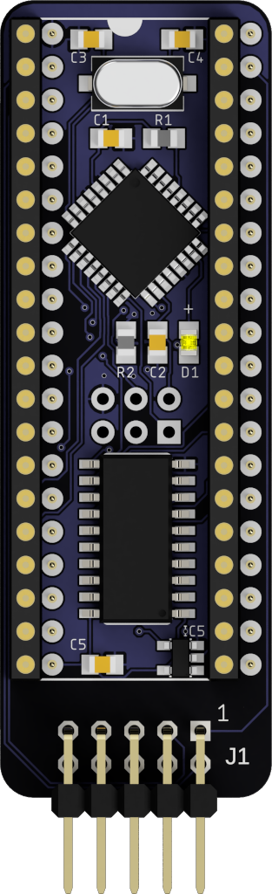
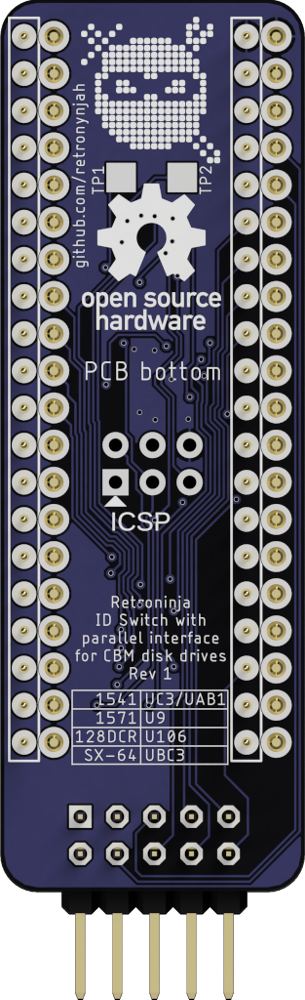
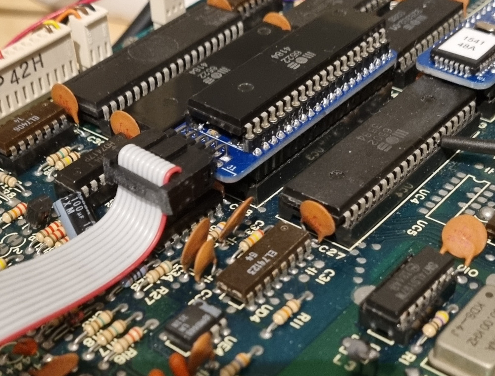

# CBM Drive ID Switch
   

This is a software controlled device ID switch for Commodore disk drives. It can be installed in any Commodore IEC disk drive but it only makes sense to install it in the drives that lack external DIP switches for ID selection but handy for the 1541 drive and for computers with built-in disk drives such as SX-64, C128D and C128DCR. 

## How it works
There's a microcontroller on the PCB that listens for strings of text on the drive data bus. Once a predefined string of bytes arrives on the bus, it flips the drive ID select pins on the VIA and resets the drive. 
The command that the drive listens for is x@RNDRVID where x is a number representing the drive ID to switch to.
Valid device numbers are 8, 9, 10, 11. In the switch command, these are specified as 8, 9, 0, 1. I.e. 0@RNDRVID is the command for switching to device #10. See the usage section for more information on the command.


## Installation

The installation is quite simple if the VIA chips are socketed. Just remove the correct VIA chip (MOS 6522) indicated in the table below, then install the switch in the socket and install the VIA chip in the switch. There is a notch printed on the top of the switch. This notch should be aligned with the notch on the socket.  
If the VIA is soldered to the PCB you will need to first desolder the VIA and install a socket (unless you want to solder the switch to the PCB which I wouldn't recommend). If you need to remove the VIA chip from the switch, be careful with the compoments on top of the PCB. Don't use any sharp objects to pry the chip out of the headers.


|Model			| VIA			| 
|:-----------:	|:-----------:	|
|1541			| UC3 or UAB1	|
|1571 (in 128D) | U9		  	|
|128DCR			| U106			|
|SX-64			| UBC3			|





## Usage

The device ID can be switched from basic using regular CBM DOS commands or by using DOS wedge commands from JiffyDOS or similar. 
Once the ID has been switched, the ID is saved and the drive will startup with the new ID until the ID is changed again. Resetting or power cycling the drive doesn't affect the saved ID.

In the below examples we switch ID of device #8 to device #9. 

#### From CBM DOS

The easiest command to use to get bytes on the drive bus is the LOAD command but other disk commands can be used too.  
```LOAD "9@RNDRVID",8```  
This generates a file not found error (unless you have a file named 9@RNDRVID ;) ). This error is to be expected and nothing to worry about.  

#### From JiffyDOS
```@"9@RNDRVID",8```  
or activate the drive first using CTRL+D or using @8 and use this command:  
```@9@RNDRVID```


## BOM


|Qty|Identifier |Part						|Comments							|
|---|----------	|---------------------------|-----------------------------------|
| 1 |IC2        |ATmega48A (TQFP32)			|Or compatible						|
| 1 |IC4        |SN74AHCT273NSR (SO20)     	|									|
| 1 |IC5        |SN74AHCT1G04DBVR (SOT23-5)	|									|
| 3 |C1,C2,C5   |100nF 0805    				|Ceramic capacitor					|
| 2 |C3,C4      |30pF 0805					|Ceramic capacitor					|
| 1 |R1         |10kΩ 0805					|									|
| 1 |Y1         |ECS-200-20-3X-TR			|Crystal 20MHz						|
| 2 |			|Female header row 			|20pin 2.54mm (for VIA chip)        |
| 2 |			|Male header row			|20pin 2.54mm (round or flat pins)	|
| 1 |D1			|LED 0805					|Optional							|
| 1 |R2			|560Ω 0805					|Optional							|

You can use any larger pin-compatible ATmega MCU such as ATmega88 or ATmega328.  
All variants seem to work including the not 100% pin-compatible PB version.  
The test points TP1 and TP2 are connected to ATmega pins PC1 and PC2 (Arduino pins A1 and A2) and can possibly be used for debugging or for some external connections.  
The optional LED (D1) and its resistor can also be used for debugging purposes but are difficult to see when VIA is installed so the may as well be left out. 

Installaion in the plastic version of C128D with the 1571 controller board covered by an RF shield requires a low profile switch. Flat stackable headers (Arduino shield headers) soldered from the top side is recommended in this case.  
  
Place a socket under the PCB and insert the stackable header pins through the PCB and solder them in place from the top side. The PCB can be removed from socket after soldering a pin on each end. The angle of the pins can then be adjusted before soldering the rest of the pins.
  
When done, cut off the header part so that only the bottom part of the pins are left.  
I haven't found any 20-pin stackable headers but two 10-pin headers on each side works fine.  

Round machined headers add a few millimeters to the height but is fine in C128DCR, SX-64 and 1541 which all have more headroom.  





## Parallel version
I also made a version with a header for a parallel cable since parallel connections can be made using the same VIA.  
   

It can be used with SpeedDos ROM+Kernal and a userport adapter such as the one designed by Sven Petersen:  
https://github.com/svenpetersen1965/1541-parallel-adapter-SpeedDOS
The header on the Drive ID Switch has the same pinout as the one on Sven Petersen's 1541 adapter.  
With the proper cable, the parallel interface can also be used for nibble transfers with a Zoomfloppy or similar interface.  

  

The pin-out of the parallel connector is connected to VIA pins according to the below table.

|Header pin |VIA pin    |
|-----------|-----------|
|1          |CA2 (39)   |
|2          |PA0 (2)    |
|3          |PA1 (3)    |
|4          |PA2 (4)    |
|5          |PA3 (5)    |
|6          |PA4 (6)    |
|7          |PA5 (7)    |
|8          |PA6 (8)    |
|9          |PA7 (9)    |
|10         |CB1 (18)   |
